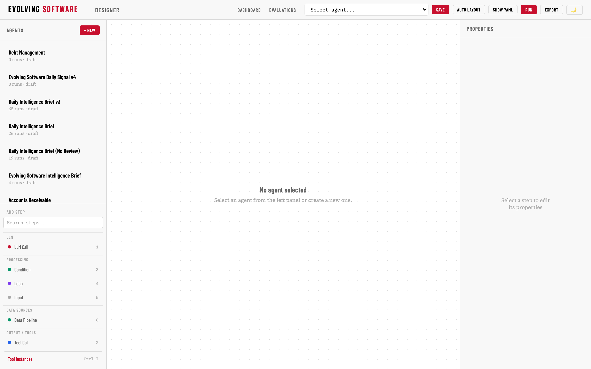
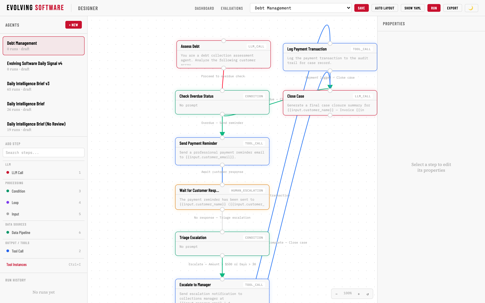
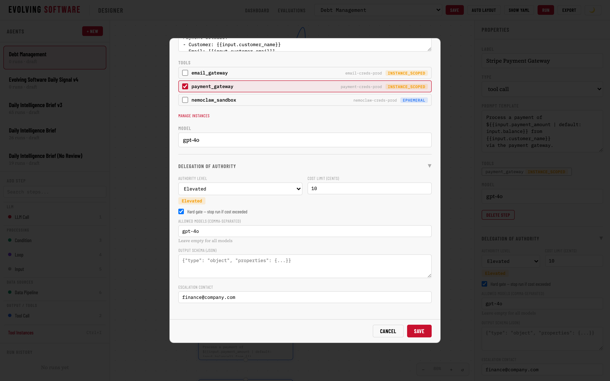
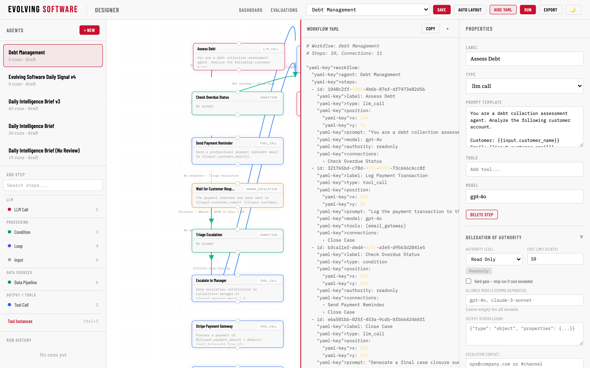

<div align="center">

# ESAM — Evolving Software Agent Manager

**Building business at agentic speed.**

A visual workflow designer and runtime for deterministic, AI-powered business processes.
YAML-native. Git-versioned. Hermes-orchestrated.

[What It Does](#-what-it-does) •
[Watch the Overview](#-watch-the-overview) •
[Architecture](#-architecture) •
[Screenshots](#-screenshots) •
[Quick Start](#-quick-start) •
[Key Differentiators](#-key-differentiators) •
[Built With](#-built-with)

</div>

---

## 🧭 What It Does

**ESAM** is a platform for building, deploying, and monitoring deterministic agent workflows. Business operators — not just engineers — can design visual pipelines with LLM calls, tool executions, human escalation steps, and payment processing — all stored as YAML in Git.

### Use Case: Debt Management

The flagship workflow automates accounts receivable collection:

| Step | Type | Authority | Integration |
|------|------|-----------|-------------|
| Assess Debt | LLM Call | Auto | Local LLM |
| Generate Demand Letter | LLM Call | Auto | Local LLM |
| Send Email | Tool Call | Auto | SMTP |
| Skip Trace via NemoClaw | Tool Call | Auto | NVIDIA NemoClaw |
| Review Assessment | Human Escalation | Elevated | Manager approval |
| Stripe Payment Gateway | Tool Call | **Elevated** | Stripe API |
| Wait for Customer Response | Human Escalation | Elevated | Email/SMS |
| Escalate to Manager | Human Escalation | Escalated | Email notification |

**The operator stays responsible FOR the loop, not IN it.**

---

## 📺 Watch the Overview

[](media/esam-hackathon-video.mp4)

*Click the image above to play the 2:19 demo video — follows a debt collection workflow end-to-end: assessing debtors via LLM, skip-tracing through NemoClaw, processing payments through Stripe, and escalating to human review.*

---

## 🏗️ Architecture


```
Operator Intent
      ↓
[Hermes Agent] ── generates ──→ YAML Workflow (.yaml)
                                      ↓
                              [Designer] ── visual editor ──→ Git Commit
                                      ↓
                              [ESAM Runtime] ── executes ──→ Traces + State
                                      ↓
                          ┌───────────┴───────────┐
                          ↓                       ↓
                  [NemoClaw Sandbox]      [Stripe Payment Gateway]
                  (skip-tracing, data)    (payment processing)

              Every step has a Delegation of Authority level:
              Auto → Elevated (requires approval) → Escalated (manager review)
```

The **ESAM Runtime** is a DAG executor that:
- Loads workflows from YAML files
- Resolves cross-step references (`{{steps.ASSESS.risk_score}}`)
- Injects credentials via the Credential Broker (never hardcoded)
- Routes sandboxed tool calls through NemoClaw for security isolation
- Records full execution traces (prompts, tokens, cost, duration)
- Supports scheduling, background execution, and webhook triggers

---

## 🖼️ Screenshots

### Designer — Empty Canvas


### Debt Management Pipeline


### LLM Call Editor


### Stripe Payment Gateway (Elevated Authority)


### YAML Source of Truth


### Wait for Customer Response (Human Escalation)


---

## 🚀 Quick Start

### Prerequisites
- Python 3.11+
- Git
- An LLM endpoint (local or remote)

### Setup

```bash
git clone https://github.com/voltomoore/esam.git
cd esam

python3 -m venv .venv
source .venv/bin/activate
pip install -r requirements.txt

cp .env.example .env
# Edit .env with your LLM endpoint

uvicorn src.api_server:app --reload
```

Open **`http://localhost:8000`** to access the Designer.

### Seed Demo Data

```bash
PYTHONPATH=src python3 src/seed_demo_agents.py
```

Creates three demo workflows: Tether Collections, Customer Support Classifier, and Loan Assessment.

---

## 📂 Project Structure

```
esam/
├── src/
│   ├── api_server.py           # FastAPI application (200+ routes)
│   ├── workflow_executor.py    # DAG execution engine
│   ├── workflow_loader.py      # YAML → workflow graph
│   ├── tool_executor.py        # Tool call execution
│   ├── sandbox_router.py       # NemoClaw sandbox routing
│   ├── credential_broker.py    # Credential injection service
│   ├── auth.py                 # JWT auth + API key management
│   ├── tracing.py              # Execution span tracing
│   ├── stripe_link.py          # Stripe payment integration
│   ├── scheduler/              # Cron + schedule engine
│   ├── routes/                 # REST endpoint modules
│   ├── connectors/             # Integration connectors
│   ├── evaluator.py            # Eval runner + scoring
│   └── ...                     # 70+ source modules
├── tests/                      # pytest suite
├── workflows/                  # Sample workflow YAMLs
├── out-of-the-box/             # Pre-built workflow templates
├── schema/                     # JSON Schema for workflows
├── tools/                      # Tool registry
├── connectors/                 # Connector manifest
└── scripts/                    # Utility scripts
```

---

## ✨ Key Differentiators

### YAML Is the Source of Truth
No database abstraction layer. The YAML file IS the workflow. Edit in the visual designer or a text editor — same result, same Git commit. The database is a cache, not the source.

### Delegation of Authority, Not Credential Scoping
Every step defines *who decides* — Auto (runs freely), Elevated (pauses for approval), Escalated (routes to manager). The AI proposes, the human disposes where it matters.

### Full Execution Traceability
Every run produces a complete span tree: prompts sent, tokens consumed, costs incurred, durations measured. Append-only, immutable, queryable.

### Supply-Chain Security
Sensitive tool calls are isolated in NemoClaw sandboxes. API keys live in the Credential Broker, not in workflow definitions or environment variables.

### Local-First
Runs entirely on your infrastructure. No SaaS dependency. LLM inference, execution, storage — all local.

---

## 🛠️ Built With

| Partner | Integration |
|---------|-------------|
| **Nous Research — Hermes Agent** | Agent orchestration, skill system, subagent delegation. Translates intent into workflow YAML. |
| **NVIDIA NemoClaw** | Sandboxed agent runtime for security-sensitive tool execution. |
| **Stripe** | Payment gateway with Delegation of Authority approval flow. |
| **SQLite** | Local-first persistence (WAL mode). |

---

## 📄 License

MIT — see [LICENSE](LICENSE).

---

<div align="center">
  <sub>Built for the <strong>Hermes Agent Accelerated Business Hackathon</strong> — NVIDIA × Stripe × Nous Research</sub><br>
  <sub>June 2025</sub>
</div>
