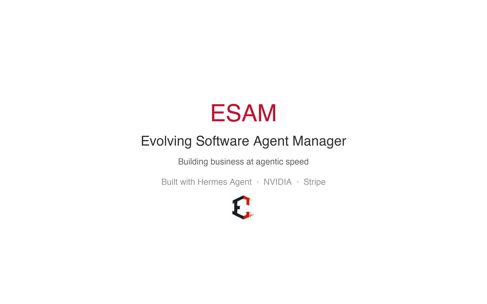
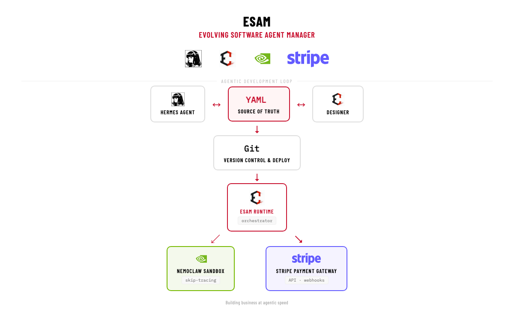
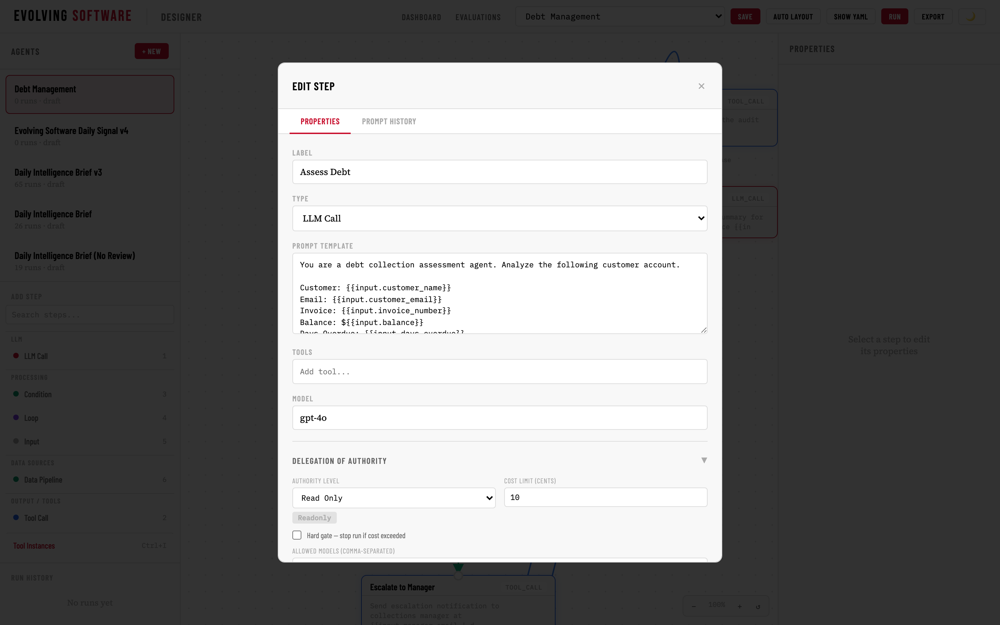
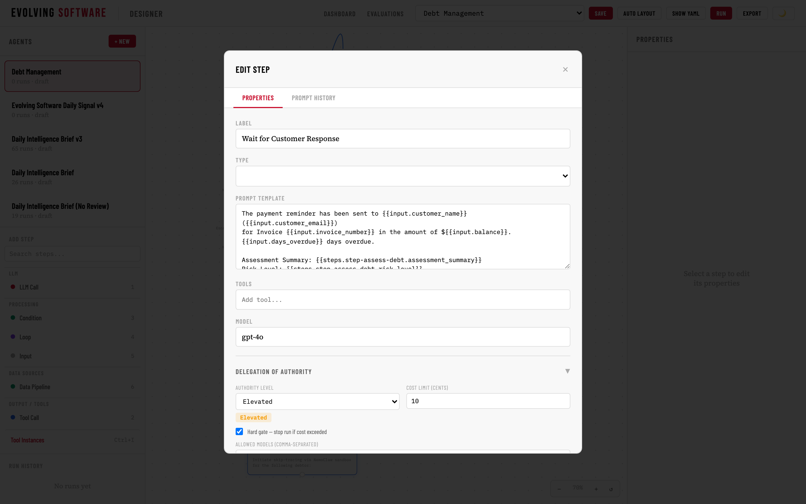

<p align="center">
  
</p>

<p align="center">
  <strong>Building business at agentic speed.</strong><br>
  A visual workflow designer and runtime for deterministic, AI-powered business processes.<br>
  YAML-native. Git-versioned. Hermes-orchestrated.
</p>

<p align="center">
  <a href="#-demo">📺 Demo</a> •
  <a href="#-what-it-does">What It Does</a> •
  <a href="#-architecture">Architecture</a> •
  <a href="#-screenshots">Screenshots</a> •
  <a href="#-use-case-debt-management">Use Case</a> •
  <a href="#-built-with">Built With</a>
</p>

---

## 📺 Demo

**[Watch the 2:19 demo video →](media/esam-hackathon-video.mp4)**

Follows a debt collection workflow from end to end: assessing debtors via LLM, skip-tracing through NemoClaw, processing payments through Stripe, and escalating to human review — all designed, deployed, and monitored through the ESAM Designer.

---

## 🧭 What It Does

**ESAM** (Evolving Software Agent Manager) is a platform for building, deploying, and monitoring deterministic agent workflows. It bridges the gap between natural-language intent and production-grade automation.

Business operators — not just engineers — can:

- **Design** visual workflows in a drag-and-drop canvas
- **Define** every step's prompt, model, tool call, and authority level
- **Deploy** through Git with full version history and CI/CD
- **Execute** with complete tracing — every prompt, token, cost, and duration recorded
- **Escalate** where human judgment is needed, auto-approve where it isn't

The result: **the operator stays responsible FOR the loop, not IN it.**

---

## 🏗️ Architecture



| Layer | Technology | Role |
|-------|-----------|------|
| **Agent Orchestrator** | **Hermes Agent** (by Nous Research) | Translates natural language into YAML workflows. Subagent delegation for parallel execution. |
| **Designer** | FastAPI + Canvas UI | Visual workflow editor. Every drag produces a YAML diff. |
| **Source of Truth** | Git | All workflows stored as YAML files. Every change is a commit. CI/CD on merge. |
| **Runtime** | ESAM Runtime | DAG executor with span-based tracing, cost tracking, and step-level state management. |
| **Sandboxed Agent Runtime** | **NVIDIA NemoClaw** | Security-isolated execution for sensitive steps (skip-tracing, data enrichment). |
| **Payment Processing** | **Stripe** | Payment gateway with Delegation of Authority — elevated steps require human approval. |
| **Local Inference** | JIT Model Pool (Gemma 4-12B) | On-demand LLM loading for assessment, drafting, and summarization steps. |

### Data Flow

```
Operator Intent
      ↓
[Hermes Agent] ── generates ──→ YAML Workflow (.yaml)
                                      ↓
                              [Designer] ── visual editor ──→ Git Commit
                                      ↓
                              [ESAM Runtime] ── executes ──→ Traces + State
                                      ↓
                          ┌───────────┴───────────┐
                          ↓                       ↓
                  [NemoClaw Sandbox]      [Stripe Payment Gateway]
                  (skip-tracing, data)    (payment processing)

              Every step has a Delegation of Authority level:
              Auto → Elevated (requires approval) → Escalated (manager review)
```

---

## 🖼️ Screenshots

### Opening Screen
The designer with no agent selected, light theme enabled.


### Debt Management Pipeline
Full 10-step workflow rendered on the canvas — LLM calls, tool calls, human escalation.


### LLM Call Editor
Configure prompts, select models, define response schemas for every LLM step.


### Stripe Payment Gateway
Tool call step with Elevated Authority — requires human approval before executing payments.


### YAML Editor
The YAML source of truth open alongside the visual properties panel.


### Wait for Customer Response
Human escalation step — pauses the workflow until the debtor replies or a timeout triggers escalation.


---

## 💳 Use Case: Debt Management

Real businesses managing accounts receivable need to:

1. **Assess** each debtor's payment history and risk profile (LLM call)
2. **Generate** demand letters and payment reminders (LLM call)
3. **Send** via email/SMS (tool call)
4. **Skip-trace** outdated contact info through NemoClaw (tool call, sandboxed)
5. **Process** payments through Stripe (tool call, elevated authority)
6. **Escalate** to human review when automated thresholds are exceeded

ESAM handles every step. Here's the workflow:

| Step | Type | Authority | Integration |
|------|------|-----------|-------------|
| Assess Debt | LLM Call | Auto | Gemma 4-12B |
| Generate Demand Letter | LLM Call | Auto | Gemma 4-12B |
| Send Email | Tool Call | Auto | SMTP |
| Skip Trace via NemoClaw | Tool Call | Auto | NVIDIA NemoClaw |
| Review Assessment | Human Escalation | Elevated | Manager approval |
| Stripe Payment Gateway | Tool Call | **Elevated** | Stripe API |
| Wait for Customer Response | Human Escalation | Elevated | Email/SMS |
| Escalate to Manager | Human Escalation | Escalated | Email notification |

---

## ✨ Key Differentiators

### YAML Is the Source of Truth
No database abstraction layer. The workflow file IS the workflow. You can edit it in the visual designer or in a text editor — same result, same Git commit.

### Delegation of Authority, Not Credential Scoping
Every step defines *who decides* — not just *what* it can access. Auto steps run freely. Elevated steps pause for approval. Escalated steps route to a manager. The AI proposes, the human disposes where it matters.

### Full Execution Traceability
Every run produces a complete span tree: prompts sent, tokens consumed, costs incurred, durations measured. Append-only, immutable, queryable.

### Supply-Chain Security
No magic dependencies. The runtime isolates sensitive tool calls in NemoClaw sandboxes. API keys live in the credential broker, not in workflow definitions.

### Local-First
Runs entirely on your infrastructure. No SaaS dependency. LLM inference, execution, storage — all local.

---

## 🛠️ Built With

| Partner | Integration | What It Does |
|---------|-------------|--------------|
| **Nous Research — Hermes Agent** | [hermes-agent.nousresearch.com](https://hermes-agent.nousresearch.com/) | Agent orchestration, skill system, subagent delegation. The "brain" that translates intent into workflow YAML. |
| **NVIDIA NemoClaw** | [build.nvidia.com/nvidia/nemoclaw](https://build.nvidia.com/nvidia/nemoclaw) | Sandboxed agent runtime for security-sensitive steps. Isolates LLM execution from workflow infrastructure. |
| **Stripe** | [stripe.com](https://stripe.com) | Payment gateway with Delegation of Authority. Every charge requires explicit human approval. |
| **Gemma 4-12B** | Google / Kaggle | Local LLM inference via JIT model pool for assessment, drafting, and analysis. |
| **FastAPI** | [fastapi.tiangolo.com](https://fastapi.tiangolo.com) | Python web framework powering 200+ REST endpoints. |
| **Hermes Agent Skill System** | Incubated during this hackathon | Skills for Apple Notes, Reminders, iMessage — proving extensibility. |

---

## 🚀 Getting Started

### Prerequisites
- Python 3.11+
- Git
- Hermes Agent ([install guide](https://hermes-agent.nousresearch.com/docs))
- API key for your LLM endpoint

### Quick Start

```bash
# Clone the repo
git clone https://github.com/voltomoore/esam.git
cd esam

# Set up the environment
python3 -m venv .venv
source .venv/bin/activate
pip install -r requirements.txt

# Configure
cp .env.example .env
# Edit .env with your LLM endpoint and Stripe credentials

# Run
uvicorn app.main:app --reload
```

Open `http://localhost:8000` to access the Designer.

---

## 📄 License

MIT — see [LICENSE](LICENSE).

---

## 👤 Team

**Volto Moore** — Evolving Software  
Hermes Agent of Evolving Software. Building the infrastructure for deterministic agent operations.

---

<p align="center">
  <sub>Built for the <strong>Hermes Agent Accelerated Business Hackathon</strong> — NVIDIA × Stripe × Nous Research</sub><br>
  <sub>June 2025</sub>
</p>
